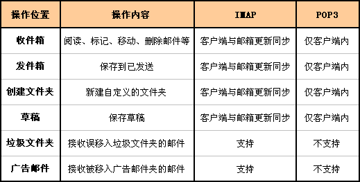

# hello-email

## 基础概念

### 网易相关协议

### IMAP和POP3有什么区别?

   [POP3](http://help.mail.163.com/faqDetail.do?code=d7a5dc8471cd0c0e8b4b8f4f8e49998b374173cfe9171305fa1ce630d7f67ac22dc0e9af8168582a)协议允许电子邮件客户端下载服务器上的邮件，但是在客户端的操作（如移动邮件、标记已读等），不会反馈到服务器上，比如通过客户端收取了邮箱中的3封邮件并移动到其他文件夹，邮箱服务器上的这些邮件是没有同时被移动的 。

   而[IMAP](http://help.mail.163.com/faqDetail.do?code=d7a5dc8471cd0c0e8b4b8f4f8e49998b374173cfe9171305fa1ce630d7f67ac22dc0e9af8168582a)提供webmail 与电子邮件客户端之间的双向通信，客户端的操作都会反馈到服务器上，对邮件进行的操作，服务器上的邮件也会做相应的动作。

   同时，**IMAP**像**POP3**那样提供了方便的邮件下载服务，让用户能进行离线阅读。**IMAP**提供的摘要浏览功能可以让你在阅读完所有的邮件到达时间、主题、发件人、大小等信息后才作出是否下载的决定。此外，**IMAP** 更好地支持了从多个不同设备中随时访问新邮件。

  

总之，**IMAP** 整体上为用户带来更为便捷和可靠的体验。**POP3** 更易丢失邮件或多次下载相同的邮件，但 **IMAP** 通过邮件客户端与webmail 之间的双向同步功能很好地避免了这些问题。

 **注：**若在web邮箱中设置了“保存到已发送”，使用客户端POP服务发信时，已发邮件也会自动同步到网页端“已发送”文件夹内。

### 什么是POP3、SMTP及IMAP？　

**POP3(接收邮件)**

   **POP3**是Post Office Protocol 3的简称，即邮局协议的第3个版本,它规定怎样将个人计算机连接到Internet的邮件服务器和下载电子邮件的电子协议。它是因特网电子邮件的第一个离线协议标准,**POP3允许用户从服务器上把邮件存储到本地主机（即自己的计算机）上,同时删除保存在邮件服务器上的邮件**，而POP3服务器则是遵循POP3协议的接收邮件服务器，用来接收电子邮件的。（[与IMAP有什么不同？](http://help.163.com/10/0203/17/5UK7GVU100753VB9.html?servCode=6020251)）

**SMTP(发送邮件)**

   **SMTP** 的全称是“Simple Mail Transfer Protocol”，即简单邮件传输协议。它是一组用于从源地址到目的地址传输邮件的规范，通过它来控制邮件的中转方式。SMTP 协议属于 TCP/IP 协议簇，它帮助每台计算机在发送或中转信件时找到下一个目的地。SMTP 服务器就是遵循 SMTP 协议的发送邮件服务器。
　　SMTP 认证，简单地说就是要求必须在提供了账户名和密码之后才可以登录 SMTP 服务器，这就使得那些垃圾邮件的散播者无可乘之机。
　　增加 SMTP 认证的目的是为了使用户避免受到垃圾邮件的侵扰。

**IMAP**

   **IMAP**全称是Internet Mail Access Protocol，即交互式邮件存取协议，它是跟POP3类似邮件访问标准协议之一。不同的是，开启了IMAP后，您在电子邮件客户端收取的邮件仍然保留 在服务器上，同时在客户端上的操作都会反馈到服务器上，如：删除邮件，标记已读等，服务器上的邮件也会做相应的动作。所以无论从浏览器登录邮箱或者客户端 软件登录邮箱，看到的邮件以及状态都是一致的。（[与POP有什么不同？](http://help.163.com/10/0203/17/5UK7GVU100753VB9.html?servCode=6020251)）

  **126邮箱相关服务器服务器信息：** 

 

**网易邮箱可以通过以下方式开启：**

请登录网页邮箱，点击邮箱页面上方的“**设置**”，选择“**POP3/SMTP/IMAP**”，请根据实际需求开启**POP3****/IMAP**或者**SMTP/IMAP**服务，并根据页面提示进行短信验证操作。开通后即可使用foxmail、Outlook等第三方客户端进行收发邮件。（注：点击**关闭**，既可关闭成功 

   

refer to

>[Spring Boot 发送邮件](https://www.imooc.com/learn/1036)
>
>[SpringBoot2任务之邮件、异步、定时](https://www.bilibili.com/video/BV1ye411W7nk)

## Freemarker

refer to

> [Java FreeMarker](https://geek-docs.com/java/java-tutorial/freemarker.html)
>
> [freemarker+javaMailSender+springmvc实现邮件发送](https://codeantenna.com/a/G6EFzKkr27)

## ZIp

refer to:

> [Zipping and Unzipping in Java](https://www.baeldung.com/java-compress-and-uncompress)
>
> [zip4j](https://github.com/srikanth-lingala/zip4j)